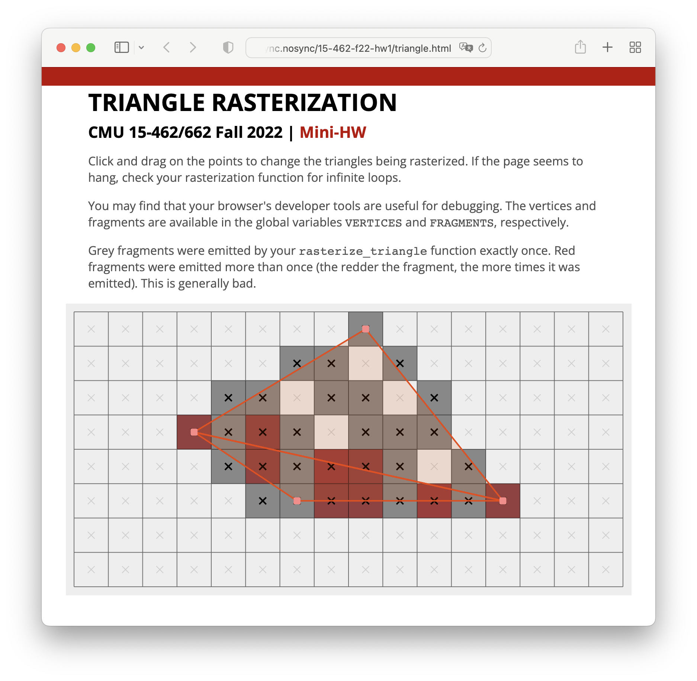

# HW1: Rasterization Warm-Up

For this homework, you will work in javascript to rapidly prototype line and triangle rasterization functions.

Before you start, please get all the files you will need by running `git clone https://github.com/CMU-Graphics/15-462-f22-hw1.git` in the directory you want to work in.

## What To Do

1. Fill in the `rasterize_line` function in `line.html` (see specification in the comment above it).
2. Fill in the `rasterize_triangle` function in `triangle.html` (see specification in the comment above it).

The files can be opened in a web browser to interactively test your functions. You can directly double click the `.html` file. You should see this in your browser:

We will consider the homework successful if your rasterization functions produce good coverage on "easy"/"unambiguous" cases (lines that don't go through diamond vertices, triangles that don't go through pixel centers).
However, any work spent discovering and handling more difficult cases _will be useful in A1._

## What To Turn In

1. Turn in your edited `line.html` and `triangle.html` files on Gradescope.
2. (Optional) if you find any particularly difficult test cases, screenshot them and post to Piazza.
